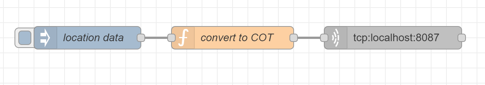
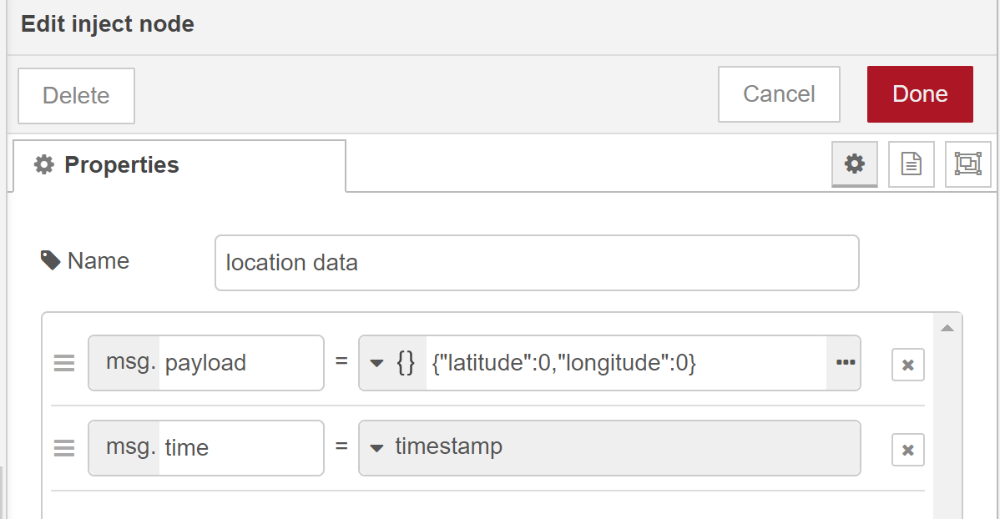
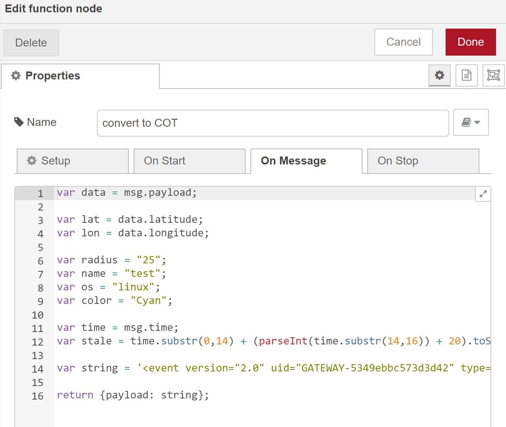
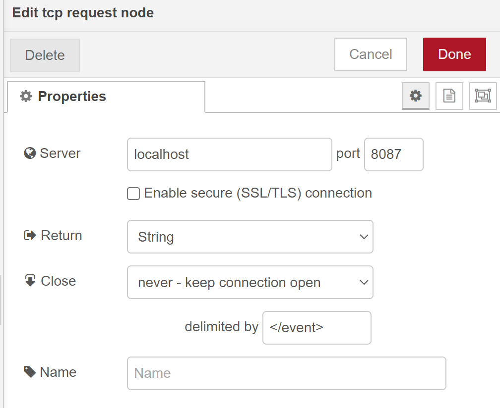

# Node-RED and TAK Integration

## Objective

Our goal in this lab is to connect Node-RED and TAK by displaying location data in TAK software.

## Getting Started

These instructions will take you through setting up a Node-RED flow for sending data to a TAK server.

__You will need:__
* Node.js
* Node-RED
* TAK client
* Taky server

## Node-RED Set Up

### Installation

1. [Install](https://nodejs.org/en/download/) the latest LTS version of Node.js
    1. To verify whether this was installed properly run ```node -v``` and ```npm -v``` (the system should display what node and npm version is installed on your system)
2. [Install](https://nodered.org/docs/getting-started/local) Node-RED locally with npm

### Check

1. Check whether you installed it correctly by running ```node-red``` in your terminal
2. Navigate to http://localhost:1880/ which should automatically direct you to your flow (unless you changed the port number in configuration)

## TAK Set Up

### Installation

[Install](https://www.civtak.org/download-atak/) a TAK client

### Taky Server Set Up

[Install](https://github.com/tkuester/taky) a Taky server

## Create Node-RED Flow

1. Navigate to http://localhost:1880/ (or you ```[host]:1880``` if you are not using Node-RED locally)
2. Make a flow in Node-RED that looks like the example below
    1. If you already have a location data source, you can use that. For the sake of this tutorial, I will be using an inject node.

3. Configure your inject node

4. Configure the function node
    1. You can copy and paste my function from the ```function.js``` file in this repository. Feel free to change the variables as needed.

5. Configure the TCP node
    1. If your Taky server and Node-RED instances are not on the same server/host, replace ```localhost``` with your corresponding host
    2. The default port number for Taky is ```8087``` or ``8089``, if you changed this in your configuration file, make sure you put the correct port number.


## Testing

Every thing should be set up so if you press the inject nodes, a cyan dot should appear in your TAK client.

## Conclusion

In this tutorial, you learned how to integrate Node-RED and a TAK client for location data.